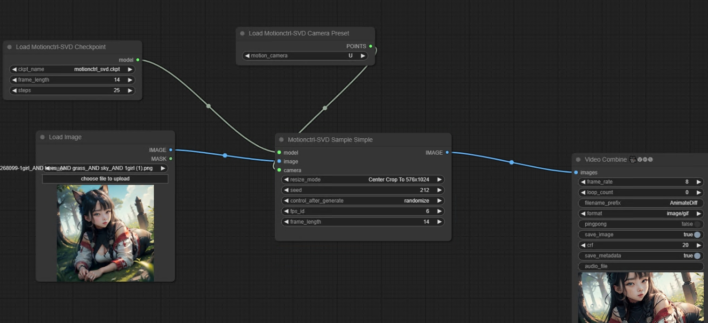

# This is an implementation of ComfyUI MotionCtrl for SVD

[MotionCtrl for SVD](https://github.com/TencentARC/MotionCtrl/tree/svd)

## Install

1. Clone this repo into custom_nodes directory of ComfyUI location

2. Run pip install -r requirements.txt

3. Download the weights of MotionCtrl  [motionctrl.pth](https://huggingface.co/TencentARC/MotionCtrl/blob/main/motionctrl.pth) and put it to `ComfyUI/models/checkpoints`

## Examples

base workflow

https://github.com/chaojie/ComfyUI-MotionCtrl-SVD/blob/main/workflow.json